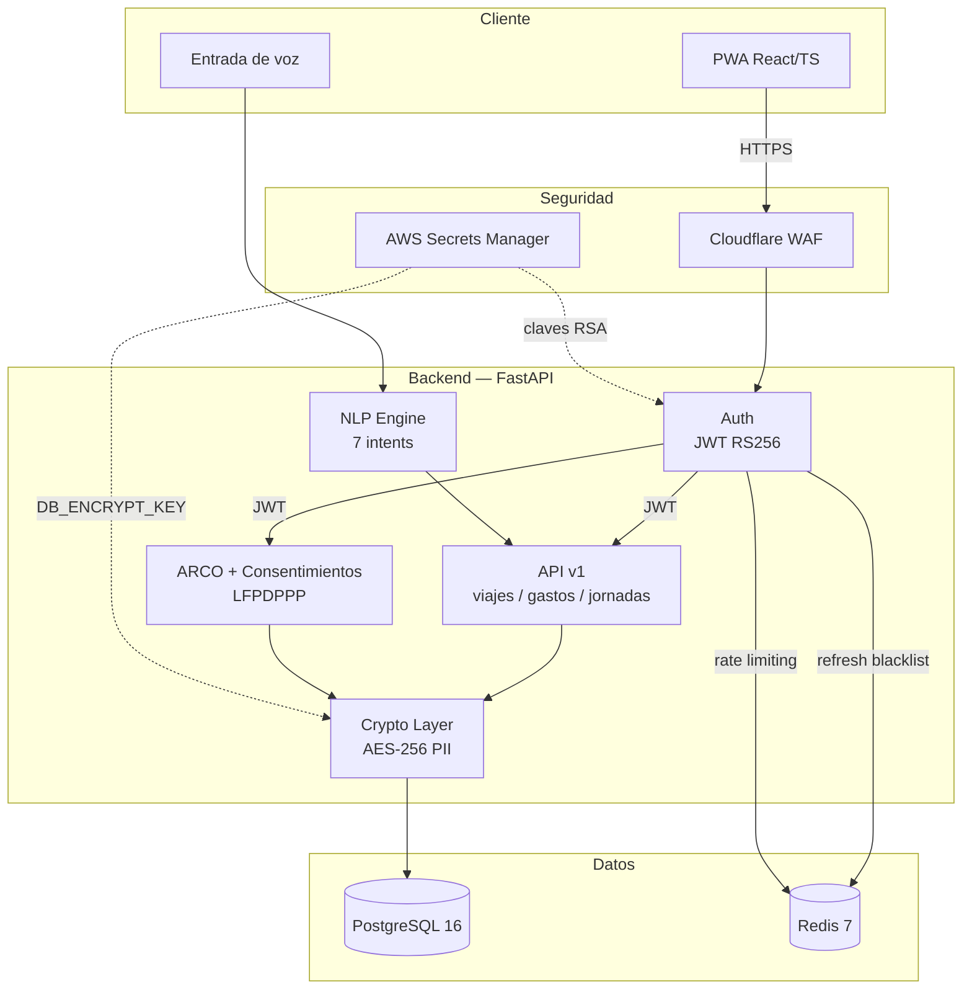
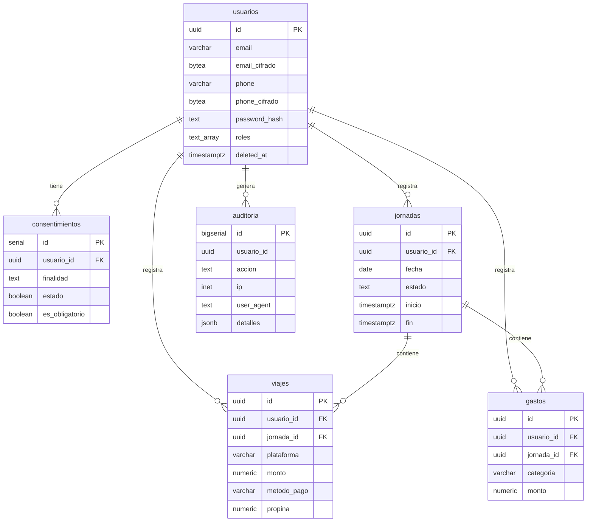

# Project Y4GA

**Co-piloto financiero para conductores de plataforma en México**

YAGA es una plataforma Fintech diseñada para conductores de Uber y DiDi en México. Permite registrar viajes, gastos y jornadas mediante comandos de voz en español mexicano, con análisis comparativo de ingresos y cumplimiento fiscal automatizado.

> [y4ga.app](https://y4ga.app)

---

## Proyectos

### YAGA — Asistente financiero para conductores

Aplicación web progresiva (PWA) que funciona como copiloto durante las jornadas de trabajo. Los conductores pueden registrar operaciones por voz sin soltar el volante, consultar su balance en tiempo real y recibir resúmenes de jornada.

**Características principales:**
- Registro de viajes y gastos por comandos de voz (NLP determinista, 7 intents en español MX)
- Dashboard estilo cockpit diseñado para lectura periférica en movimiento
- Módulo de mantenimiento vehicular con alertas
- Motor de análisis comparativo contra ~3,300 viajes históricos reales
- Gestión de consentimientos y derechos ARCO (LFPDPPP)
- Operación offline-first con sincronización posterior

**Estado de sprints:**

| Sprint | Módulo | Estado |
|--------|--------|--------|
| 1 | Tracker financiero por voz | Completo |
| 2 | Dashboard cabin (cockpit PWA) | En progreso |
| 3 | Módulo de mantenimiento vehicular | Completo |

### Poleana — Juego de mesa mexicano online

Implementación multijugador online de un juego de mesa tradicional mexicano. Motor de reglas inyectable que soporta variantes de torneo y callejeras.

**Características principales:**
- Motor Python con `PoleanaRuleSet` inyectable (`TOURNAMENT_RULES` / `STREET_RULES`)
- Interfaz web con Cloudflare Pages
- Matchmaking y lobby en tiempo real vía WebSocket
- Arquitectura server-authoritative (migración en curso)

> Repositorio: [Poleana_Project](https://github.com/rslnt1270/Poleana_Project) (incluido como git submodule)

---

## Arquitectura técnica

### Stack

```
Backend       FastAPI (Python 3.11)
Base de datos  PostgreSQL 16 + pgcrypto
Cache/Estado   Redis 7
Frontend      PWA React 18+ / TypeScript / Vite / Tailwind CSS
Infra         Docker Compose en AWS EC2 t3.small (Amazon Linux 2023)
NLP           Clasificador determinista por keywords (sub-200ms, sin LLM)
Poleana FE    Cloudflare Pages / Workers
```

### Diagrama de arquitectura



### Modelo de datos



### Endpoints

| Grupo | Ruta | Descripción |
|-------|------|-------------|
| Auth | `POST /auth/register` | Registro con cifrado PII |
| Auth | `POST /auth/login` | Login + JWT RS256 (rate limited) |
| Auth | `POST /auth/refresh` | Rotación de tokens |
| Auth | `POST /auth/logout` | Blacklist de refresh token |
| Consentimientos | `PUT /consentimientos/` | Gestión de finalidades |
| ARCO | `GET /arco/acceso` | Descarga de datos personales (JSON) |
| ARCO | `PUT /arco/rectificacion` | Actualización de PII con re-cifrado |
| ARCO | `POST /arco/cancelacion` | Soft delete + anonimización + retención 7 años |
| ARCO | `POST /arco/oposicion` | Revocación de finalidades secundarias |
| Negocio | `/api/v1/nlp` | Procesamiento de comandos de voz |
| Negocio | `/api/v1/vehiculo` | Mantenimiento vehicular |
| Negocio | `/api/v1/historico` | Consulta de jornadas y viajes |
| Negocio | `/api/v1/comparativa` | Análisis delta entre fuentes de datos |

### Seguridad

- **Cifrado PII:** AES-256 en capa de aplicación (IV único por registro) — nunca en SQL
- **Autenticación:** JWT RS256 con RSA 2048-bit, claves rotadas vía AWS Secrets Manager
- **Rate limiting:** 5 intentos/min en endpoints de auth (slowapi + Redis)
- **Refresh tokens:** Blacklist en Redis con TTL 7 días, rotación en cada uso
- **Auditoría:** Toda acción crítica registrada con IP, user-agent y detalles JSON
- **Compliance:** LFPDPPP — consentimientos granulares, derechos ARCO completos, retención fiscal 7 años

---

## Estructura del repositorio

```
Project_Y4GA_/
├── app/                         # Backend FastAPI (módulos, routers, modelos)
├── frontend/                    # PWA React/TypeScript
├── yaga-backend/                # Configuración del servidor backend
├── infrastructure/              # Docker configs, database migrations
│   └── database/
├── data_science/                # Dataset, notebooks, ETL, análisis
├── docs/                        # Documentación técnica y PRD
├── Poleana_Project/             # Git submodule → juego de mesa online
├── .claude/                     # Agentes y comandos de Claude Code
├── docker-compose.yml
├── CLAUDE.md                    # Configuración de proyecto para IA
└── .gitmodules
```

---

## Desarrollo local

```bash
# Clonar con submodules
git clone --recurse-submodules https://github.com/rslnt1270/_Y4GA_.git
cd _Y4GA_

# Levantar servicios
docker-compose up -d

# Backend
cd app && pip install -r requirements.txt
uvicorn main:app --reload

# Frontend
cd frontend && npm install && npm run dev
```

---

## Contexto académico

YAGA es el capítulo 5 de la tesis *"Educación y Algoritmos"* — programa de doble titulación en Pedagogía (FFyL, UNAM) y Tecnologías para la Información en Ciencias (ENES Morelia). La investigación integra herramientas de IA generativa en la educación mexicana, con YAGA como aplicación práctica que demuestra la intersección entre pedagogía, ciencia de datos y desarrollo de software.

Referencia institucional: PAPIME PE110324 · UNESCO AI Competency Framework (2024)

---

## Licencia

[MIT](LICENCE)
