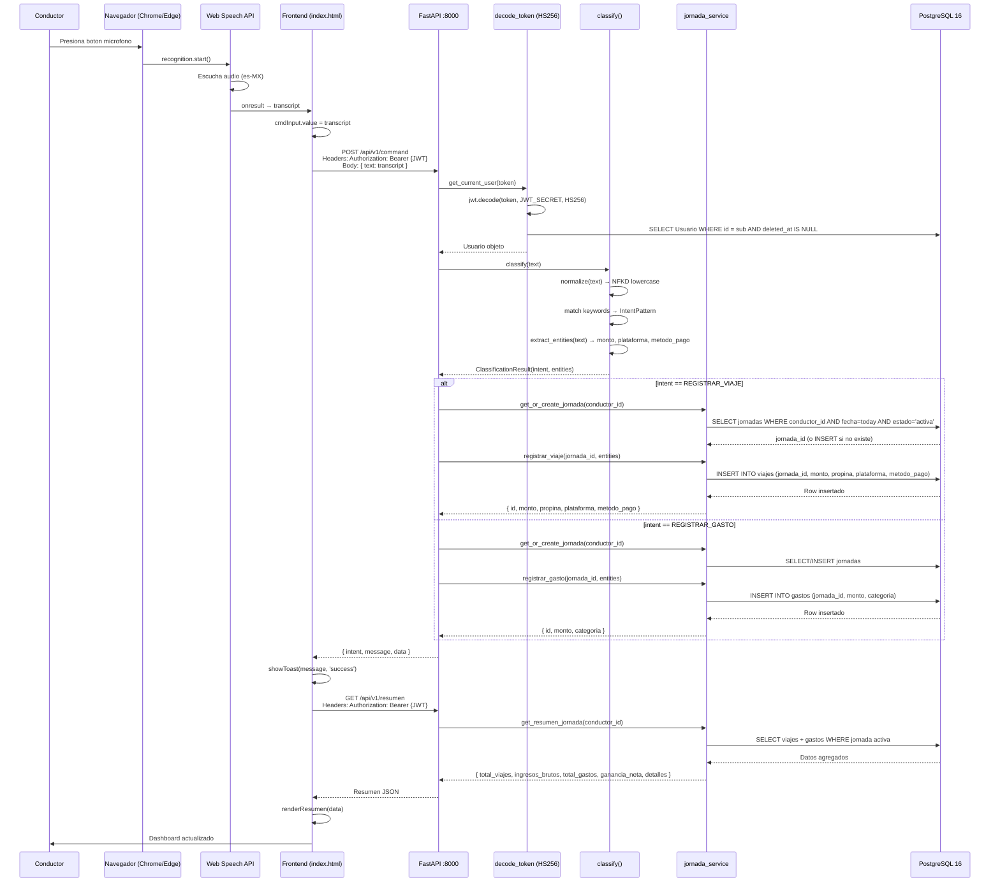
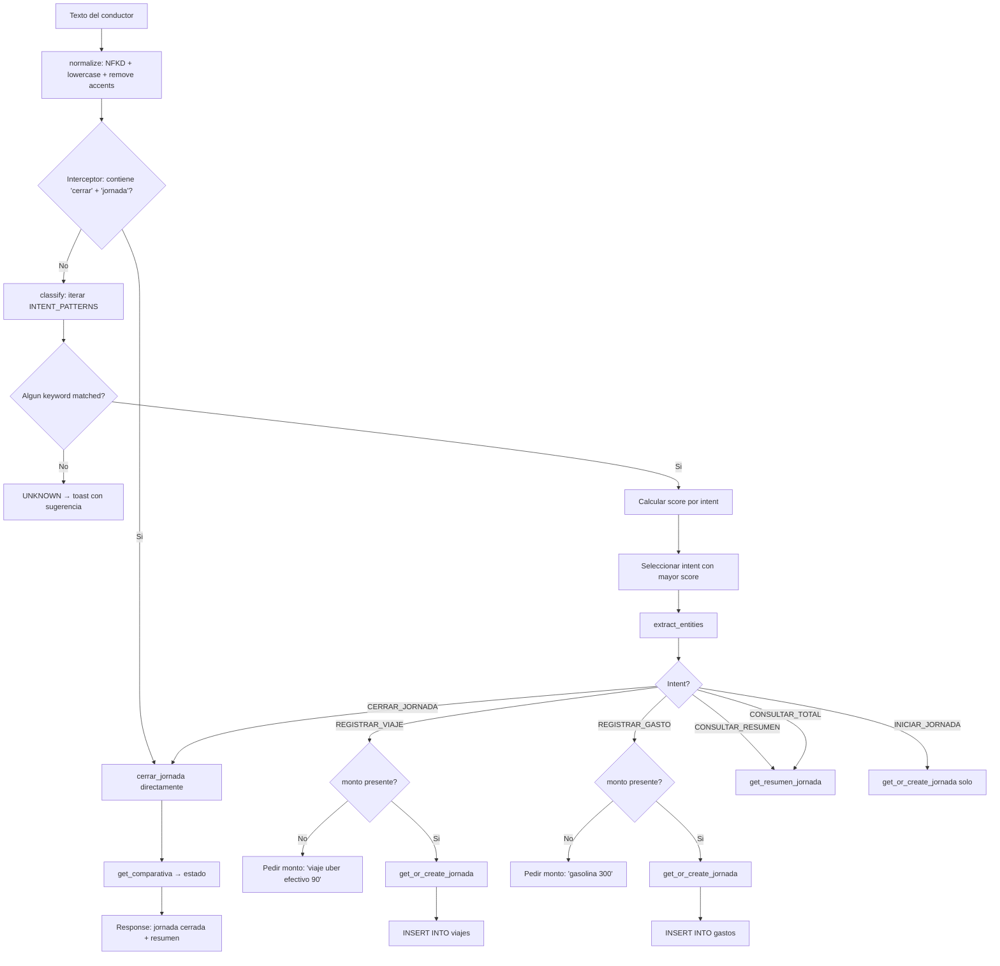
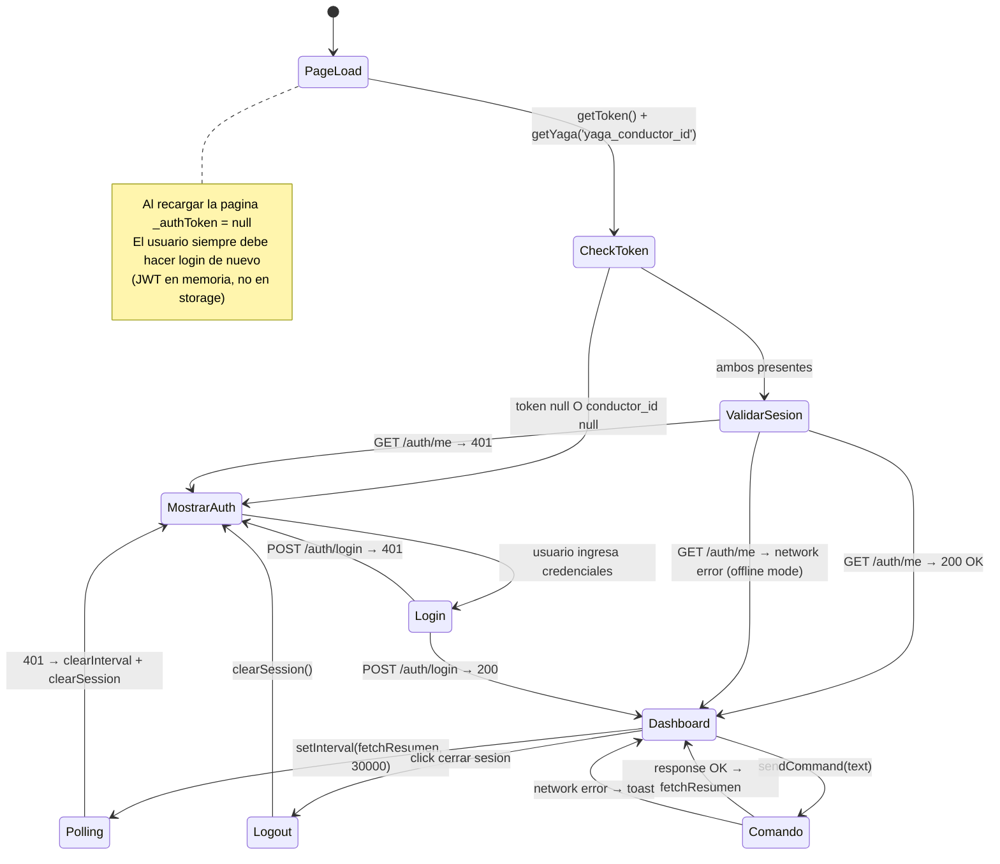

# YAGA — Workflow de Registro por Voz

Diagrama verificado contra `frontend/index.html`, `app/api/v1/nlp.py`, `app/services/nlp/classifier.py` y `app/services/jornada_service.py`.

---

## Flujo principal (happy path)

---

## Flujo de clasificacion NLP (detalle)

---

## Flujos de error

```mermaid
flowchart TD
    subgraph "Error: Sin conexion"
        E1[sendCommand fetch] -->|catch: network error| E2["showToast('Sin conexion con el servidor', 'error')"]
        E2 --> E3[statusDot → rojo]
        E3 --> E4[cmdInput se rehabilita]
    end

    subgraph "Error: Token expirado (401)"
        T1[fetch /api/v1/resumen] -->|res.status === 401| T2[clearInterval resumenInterval]
        T2 --> T3[clearSession: _authToken = null + limpiar storage]
        T3 --> T4[authScreen visible → usuario debe hacer login]
    end

    subgraph "Error: Intent UNKNOWN"
        U1[classify retorna UNKNOWN] --> U2["Response: {intent: 'unknown', message: 'No entendi...'}"]
        U2 --> U3["showToast('No entendi. Intenta: viaje uber efectivo 90 o gasolina 300')"]
        U3 --> U4[data === null → no se llama fetchResumen]
    end

    subgraph "Error: Firefox sin SpeechRecognition"
        F1{webkitSpeechRecognition in window?} -->|No| F2[btnMic deshabilitado visualmente]
        F2 --> F3["btnMic.textContent = prohibido"]
        F3 --> F4["Banner: 'Microfono inactivo en Firefox — usa Chrome o Edge para voz'"]
        F4 --> F5[Click en btnMic → showToast error]
        F1 -->|Si| F6[recognition inicializado normalmente]
    end

    subgraph "Error: Audio no capturado"
        A1[recognition.onerror] --> A2[Remover clase 'listening']
        A2 --> A3["showToast('No se pudo capturar audio', 'error')"]
    end
```

---

## Flujo de sesion (lifecycle completo)

---

## Notas tecnicas

1. **Web Speech API** solo esta disponible en Chrome y Edge. Firefox no implementa `webkitSpeechRecognition` ni `SpeechRecognition`. El frontend detecta esto al cargar y muestra un banner permanente.

2. **Latencia del clasificador NLP:** El clasificador es determinista por keywords, sin modelo ML ni llamada a API externa. La latencia es sub-1ms en el servidor. El cuello de botella es la red y la query a PostgreSQL.

3. **Polling vs WebSocket:** El dashboard se actualiza via polling cada 30 segundos (`setInterval(fetchResumen, 30000)`). No hay WebSocket para el dashboard (solo Poleana usa WebSocket).

4. **Jornada automatica:** Si no existe jornada activa para hoy, `get_or_create_jornada` crea una automaticamente al primer comando del dia. El conductor no necesita decir "iniciar jornada" explicitamente.

5. **conductor_id en body:** El frontend envia `conductor_id` en el body de `/command` como legacy, pero el backend lo ignora — usa `current_user.id` del token JWT.
